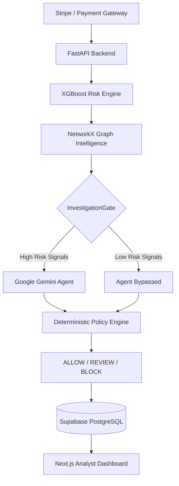

<div align="center">
  
  
  
  
  
</div>

<br/>

<div align="center">
  <h1>RiskSentinel X</h1>
  <p><b>An Enterprise-Grade, AI-Native Fraud Investigation Platform</b></p>
  <p>Models detect. Graphs connect. Agents investigate. Policies decide.</p>
</div>

---

## Overview

RiskSentinel X is a full-stack, evidence-driven risk investigation platform engineered to resolve the critical flaw in modern fraud detection: the gap between algorithmic scoring and human decision-making.

While traditional systems effectively flag suspicious transactions via risk scores, investigators remain burdened by manual relationship mapping and policy application. RiskSentinel X automates this operational bottleneck through a strict pipeline of **XGBoost transaction scoring**, **NetworkX graph collusion detection**, and **Agentic AI investigation**, culminating in a deterministic rule engine.

The platform delivers explainable **ALLOW / REVIEW / BLOCK** decisions backed by a complete, immutable audit trail.

---

## Core Capabilities

- **Machine Learning Risk Scoring:** Real-time transaction classification utilizing XGBoost, optimized and trained on the IEEE-CIS Fraud dataset.
- **Graph Intelligence Engine:** In-memory Louvain community detection maps shared devices, IP addresses, and payment instruments to identify coordinated fraud rings instantaneously.
- **Agentic AI Investigation:** Integrates the Google Gemini API as an autonomous agent to synthesize complex transactional evidence into structured JSON recommendations.
- **Deterministic Policy Governance:** Enforces a strict separation of AI recommendation from final authority. An immutable Policy Engine guarantees that Large Language Models (LLMs) cannot unilaterally authorize or block funds.
- **Real-Time Analytics Dashboard:** High-performance Next.js interface providing live operational metrics, cost-impact simulations, and manual case-resolution queues.
- **Enterprise Auditability:** Every system decision is fully reconstructable. ML scores, graph risk variables, agent prompts, and matched policy rules are persistently logged to PostgreSQL.

---

## System Architecture

RiskSentinel X treats fraud investigation as a strict pipeline of separable responsibilities:



---

## Technology Stack

RiskSentinel X is built upon modern, scalable technologies tailored for high-throughput enterprise environments.

| Component | Technology | Description |
|-----------|------------|-------------|
| **Frontend** | Next.js 15, React, TailwindCSS | High-performance, responsive analyst dashboard deployed on Vercel. |
| **Backend API** | Python, FastAPI, Pydantic | Asynchronous, type-safe REST API deployed on Render. |
| **Database** | PostgreSQL (Supabase) | Highly available, relational data persistence with complete audit logging. |
| **Machine Learning**| XGBoost, scikit-learn | Precision-oriented gradient boosting classifiers. |
| **Graph Engine** | NetworkX, python-louvain | In-memory entity resolution and community detection. |
| **AI Agent** | Google Gemini API | Bounded LLM inference utilizing structured outputs and read-only tools. |

---

## Deployment & Configuration

### Local Development Environment

1. **Prerequisites**
   - Docker & Docker Compose
   - Node.js (v18+)
   - Python (3.10+)
   - Google Gemini API Key (`GEMINI_API_KEY`)
   - Supabase Database URL (`DATABASE_URL`)

2. **Clone & Configure**
   ```bash
   git clone https://github.com/JakkulaVeerababu/risksentinel-X.git
   cd risksentinel-X

   # Configure Backend
   cd backend
   cp .env.example .env
   # Add GEMINI_API_KEY and DATABASE_URL to .env

   # Configure Frontend
   cd ../frontend
   cp .env.local.example .env.local
   # Set NEXT_PUBLIC_API_BASE_URL=http://localhost:8000
   ```

3. **Initialize Services**
   ```bash
   docker-compose up --build -d
   ```
   Initialize the frontend dashboard:
   ```bash
   cd frontend
   npm install
   npm run dev
   ```
   The Analyst Dashboard will be available at `http://localhost:3000`.

### Production Deployment

RiskSentinel X is architected for cloud-native deployment.
- **Frontend (Vercel):** Seamless integration for edge caching and global CDN delivery.
- **Backend (Render):** Dockerized FastAPI service deployed as a Web Service.
- **Database (Supabase):** Fully managed PostgreSQL instance handling relational data and audit trails.

**Live API Endpoint:** `https://risksentinel-backend.onrender.com/api/v1`

---

## AI Governance & Security Framework

A fundamental design principle of RiskSentinel X is **Safe AI Integration**.

Recognizing that LLMs are susceptible to hallucination and prompt injection, RiskSentinel X enforces strict operational boundaries:
1. **Read-Only Tools:** The Gemini Agent operates with restricted permissions, capable only of reading graph context and transaction history. It lacks write access to the database.
2. **Advisory Outputs:** AI outputs are strictly constrained to a recommendation and a confidence score.
3. **Deterministic Authority:** The hardcoded `PolicyService` executes the final outcome. Any LLM recommending a block on a low-risk transaction is automatically overridden and allowed by the Policy Engine.

---

## License

Distributed under the MIT License. See `LICENSE` for more information.
