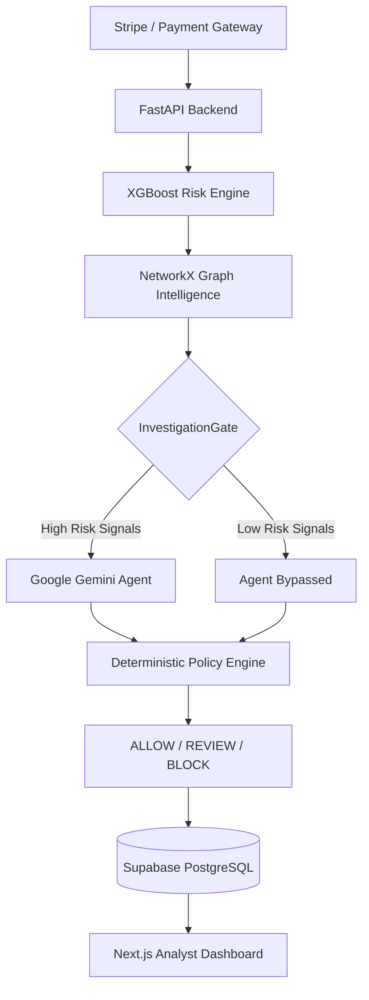

<div align="center">
  
  
  
  
  
</div>

<br/>

<div align="center">
  <h1>🛡️ RiskSentinel X</h1>
  <p><b>An Enterprise-Grade, AI-Native Fraud Investigation Platform</b></p>
  <p>Models detect. Graphs connect. Agents investigate. Policies decide.</p>
</div>

---

## 📖 Overview

**RiskSentinel X** is a full-stack, evidence-driven risk investigation platform designed to solve the critical flaw in modern fraud detection: **the gap between algorithmic scoring and human decision-making.**

While traditional systems can flag suspicious transactions with a risk score, investigators still spend hours manually uncovering relationships and applying governance policies. RiskSentinel X automates this entirely by pipelining **XGBoost transaction scoring**, **NetworkX graph collusion detection**, and **Agentic AI investigation (Google Gemini)** into a deterministic rule engine.

The result? Explainable **ALLOW / REVIEW / BLOCK** decisions with a complete, immutable audit trail.

---

## ✨ Enterprise Features

- 🧠 **Machine Learning Risk Scoring:** Real-time transaction classification using XGBoost trained on the IEEE-CIS Fraud dataset.
- 🕸️ **Graph Intelligence Engine:** Louvain community detection maps out shared devices, IP addresses, and payment instruments to instantly identify coordinated fraud rings.
- 🤖 **Agentic AI Investigation:** Integrates the Google Gemini API as an autonomous agent to synthesize complex evidence into structured JSON recommendations.
- ⚖️ **Deterministic Policy Governance:** Strict separation of *AI recommendation* from *final authority*. An immutable Policy Engine guarantees LLMs can never unilaterally authorize or block funds.
- 📊 **Real-Time Analytics Dashboard:** Beautiful Next.js frontend with live operational metrics, cost-impact simulations, and manual case-resolution queues.
- 🔒 **Enterprise Auditability:** Every decision is reconstructable. The ML score, graph risk, agent prompt, and matched policy rule are persistently logged to PostgreSQL.

---

## 🏗️ System Architecture

RiskSentinel X treats fraud investigation as a strict pipeline of separable responsibilities:



---

## 🚀 Tech Stack

RiskSentinel X is built using modern, scalable technologies tailored for high-throughput enterprise environments.

| Component | Technology | Description |
|-----------|------------|-------------|
| **Frontend** | Next.js 15, React, TailwindCSS | High-performance, responsive analyst dashboard deployed on Vercel. |
| **Backend API** | Python, FastAPI, Pydantic | Asynchronous, type-safe REST API deployed on Render. |
| **Database** | PostgreSQL (Supabase) | Highly available, relational data persistence with complete audit logging. |
| **Machine Learning**| XGBoost, scikit-learn | Precision-oriented gradient boosting classifiers. |
| **Graph Engine** | NetworkX, python-louvain | In-memory entity resolution and community detection. |
| **AI Agent** | Google Gemini API | Bounded LLM inference utilizing structured outputs and read-only tools. |

---

## 💻 Getting Started (Local Development)

To run RiskSentinel X locally for development or demonstration purposes:

### 1. Prerequisites
- Docker & Docker Compose
- Node.js (v18+)
- Python (3.10+)
- A Gemini API Key (`GEMINI_API_KEY`)
- A Supabase Database URL (`DATABASE_URL`)

### 2. Clone & Configure
```bash
git clone https://github.com/JakkulaVeerababu/risksentinel-X.git
cd risksentinel-X

# Setup Backend Environment
cd backend
cp .env.example .env
# Edit .env and add your GEMINI_API_KEY and DATABASE_URL

# Setup Frontend Environment
cd ../frontend
cp .env.local.example .env.local
# Edit .env.local and set NEXT_PUBLIC_API_BASE_URL=http://localhost:8000
```

### 3. Launch the Stack
Start the FastAPI backend and Postgres (optional if using local DB) via Docker:
```bash
docker-compose up --build -d
```

Start the Next.js frontend:
```bash
cd frontend
npm install
npm run dev
```

The Analyst Dashboard is now live at `http://localhost:3000`.

---

## 🌐 Production Deployment

RiskSentinel X is architected for cloud-native deployment. 
- **Frontend (Vercel):** Seamlessly integrates with Vercel for edge caching and global CDN delivery.
- **Backend (Render):** Dockerized FastAPI service deployed as a Web Service.
- **Database (Supabase):** Fully managed PostgreSQL instance handles the relational data and audit trails.

**Live API Endpoint:** `https://risksentinel-backend.onrender.com/api/v1`

---

## 🛡️ AI Governance & Security 

A core tenet of RiskSentinel X is **Safe AI Integration**. 

LLMs hallucinate and can be subject to prompt injection. RiskSentinel X implements strict boundaries:
1. **Read-Only Tools:** The Gemini Agent can only *read* graph context and transaction history. It cannot write to the database.
2. **Advisory Only:** The AI outputs a *recommendation* and a *confidence score*.
3. **Deterministic Authority:** The hardcoded `PolicyService` applies the final outcome. An LLM recommending a "BLOCK" on a transaction with 0.0 ML risk and 0.0 Graph risk will be overridden and allowed by the Policy Engine.

---

## 📝 License

Distributed under the MIT License. See `LICENSE` for more information.

---

<div align="center">
  <p>Built with ❤️ by Jakkula Veerababu</p>
</div>
