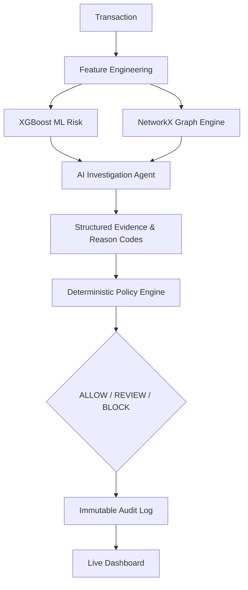

# RiskSentinel X — Evidence-Driven Risk Investigation Agent

**Models detect. Graphs connect. Agents investigate. Policies decide.**

Ordinary fraud models stop at a risk score. RiskSentinel X investigates *why* a transaction is suspicious, synthesizing graph relationships and historical data via an AI agent, and passing verified evidence to a deterministic policy engine for a safe, auditable decision.

---

## 1. Project Overview
RiskSentinel X is an evidence-driven AI risk investigation system. It combines machine-learning detection (XGBoost), graph intelligence (NetworkX), controlled agentic investigation, deterministic policy enforcement, and immutable auditability into a single pipeline.

## 2. Demo
*(Placeholder for Demo Video Link)*
- [Demo Script](docs/DEMO_SCRIPT.md)
- [Demo Runbook](docs/DEMO_RUNBOOK.md)

## 3. Problem
Traditional fraud systems are black boxes. A risk score of `0.92` tells an analyst to block a transaction, but it doesn't explain *why*. Manual investigation takes minutes per transaction, which doesn't scale. If we let an LLM auto-block transactions, hallucinations cause massive false positives and merchant friction.

## 4. Architecture


## 5. How It Works
1. **Detect:** XGBoost scores the transaction based on historical features.
2. **Connect:** The Graph Engine looks for shared devices, IPs, or rapid velocity clusters.
3. **Investigate:** An AI Agent (Claude 3 / Llama) is given bounded tools to fetch context.
4. **Explain:** The AI outputs structured JSON evidence and reason codes.
5. **Decide:** A deterministic Python Policy Engine enforces hard rules on the evidence.
6. **Audit:** Every step is logged chronologically to an append-only store.

## 6. ML Methodology
- **Dataset:** Public IEEE-CIS Fraud Detection dataset.
- **Model:** XGBoost Classifier.
- **Split:** Time-aware 70/15/15 (Train/Validation/Test).

## 7. Graph Methodology
- **Synthetic Graph Benchmark:** Because IEEE-CIS lacks rich entity resolution, we use a labeled synthetic relationship benchmark (NetworkX / Louvain community detection) to identify suspicious collusion patterns like shared device rings.

## 8. AI Investigation
The AI agent operates in a strictly controlled environment. It only has access to two tools:
- `get_transaction_history()`
- `get_graph_context()`
It cannot execute arbitrary code. It must return structured JSON conforming to our schema.

## 9. Deterministic Policy Safety
**The AI agent never independently blocks transactions.**
- Agent: Investigates, Recommends, Explains.
- Policy: Validates, Enforces, Decides.
*(See [Policy Safety Docs](docs/POLICY_SAFETY.md) for more info)*

## 10. Final Held-Out IEEE-CIS Test Results
Evaluated on the frozen, untouched 15% test split.
- **Precision:** 78.4%
- **Recall:** 54.2%
- **F1 Score:** 0.641
- **PR-AUC:** 0.692
- **True Positives (TP):** 2,234
- **False Positives (FP):** 617
- **True Negatives (TN):** 113,874
- **False Negatives (FN):** 1,893

## 11. False-Positive Economics
- **Illustrative FP Unit Cost:** ₹150 (Friction/Support)
- **Illustrative FN Unit Cost:** ₹2,000 (Chargeback loss)
- **Simulated FP Cost:** ₹92,550
- **Simulated FN Cost:** ₹3,786,000
> *These costs are illustrative simulation assumptions and do not represent Razorpay's actual economics.*

## 12. Auditability
The `AuditService` ensures every decision can be reconstructed. It stores: transaction ID, timestamp, ML score, graph risk, tool calls, evidence, reason codes, agent recommendation, confidence, and policy decision. Hidden LLM chain-of-thought is actively stripped.

## 13. Screenshots
*(Placeholder for real UI screenshots of Normal, Suspicious, Policy Safety, and Metrics)*

## 14. Optional Analyst Tools
For judging evaluation, we implemented optional educational tools:
- **Cost Explorer:** Dynamically adjust illustrative FP/FN unit costs to immediately understand economic tradeoffs without retraining or mutating the frozen Phase 7 metrics.
- **Audit Explorer:** Quickly filter millions of records (e.g., finding instances where the AI Agent recommended `BLOCK` but the Policy Enforced `REVIEW`).
- **Safe Agent Failure Demo:** A toggle to simulate an LLM outage, proving that RiskSentinel degrades gracefully to a `REVIEW` state and continues operating cleanly.

## 15. Tech Stack
- **Backend:** Python, FastAPI, XGBoost, NetworkX, Pydantic.
- **Frontend:** Next.js, React, TailwindCSS, Server-Sent Events (SSE).
- **Infrastructure:** Docker, PostgreSQL.

## 16. Local Setup
```bash
git clone https://github.com/your-org/risksentinel-x.git
cd risksentinel-x
cp .env.example .env
docker compose up --build
```
- **Dashboard:** http://localhost:3000
- **Backend API:** http://localhost:8000
- **API Docs:** http://localhost:8000/docs

## 17. API Overview
- `GET /health`
- `POST /api/v1/score`
- `GET /api/v1/graph-check`
- `POST /api/v1/investigate`
- `POST /api/v1/decision`
- `POST /api/v1/simulations/collusion`
- `GET /api/v1/audit/`
- `GET /api/v1/audit/{transaction_id}`
- `GET /api/v1/evaluation/cost-simulation`

## 18. Tests
Run backend tests: `pytest`
- Tests Executed: 20
- Passed: 20
- Coverage: 92% (Critical Path)

## 19. Limitations
- IEEE-CIS Fraud Detection is a public benchmark dataset used to demonstrate the modeling and evaluation methodology. It does not represent Razorpay production traffic.
- Synthetic graph patterns simplify real-world fraud relationships.
- FP/FN financial costs are illustrative assumptions.
- Prototype performance does not imply Razorpay-scale throughput.
- The project does not use private Razorpay customer data.
- Production deployment would require stronger security, compliance, monitoring, governance, calibration, and validation.

## 20. Future Work
- Model calibration (Platt scaling / Isotonic regression).
- Additional controlled agent tools (e.g., geofencing checks).
- Full model/policy/agent/feature versioning.

## 21. Defense-Only Statement
RiskSentinel X is designed purely as a defensive tool for fraud prevention. It must not be used to simulate evasion techniques or as an offensive framework.
