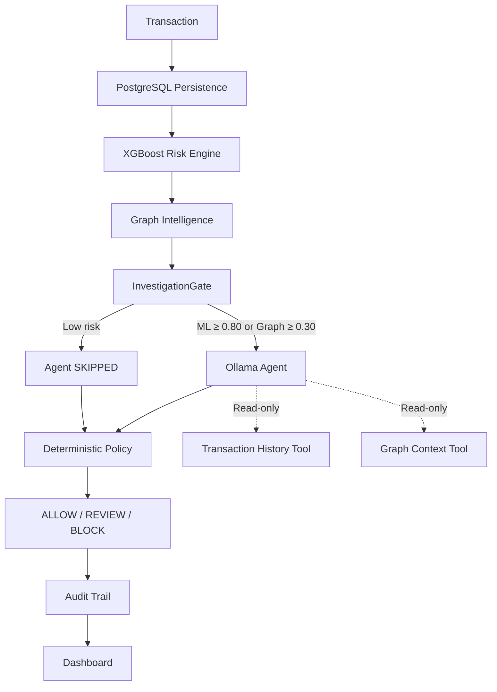

# RiskSentinel X

**Models detect. Graphs connect. Agents investigate. Policies decide.**

RiskSentinel X is an evidence-driven risk investigation platform that combines XGBoost transaction scoring, graph-based collusion detection, bounded AI investigation and deterministic policy governance to produce explainable ALLOW / REVIEW / BLOCK decisions with a complete audit trail.

---

## Problem

Fraud systems can flag suspicious transactions, but investigators still need to understand relationships, validate evidence and apply policy consistently. A risk score of `0.92` tells an analyst to block — but not *why*. If an LLM is given autonomous authority, hallucinations create false positives and governance risk.

## Solution

RiskSentinel X treats fraud investigation as a pipeline of separable responsibilities:

| Stage | Responsibility | Technology |
|-------|---------------|------------|
| **Detect** | Score transaction risk | XGBoost on IEEE-CIS features |
| **Connect** | Find related entities | NetworkX graph + Louvain communities |
| **Investigate** | Synthesize evidence | Bounded LLM agent (Ollama / llama3) |
| **Explain** | Produce structured output | Validated JSON reason codes |
| **Decide** | Apply deterministic policy | Rule engine (policy-v1) |
| **Audit** | Reconstruct any decision | PostgreSQL append-only log |

## Why Existing Approaches Fall Short

- **Score-only systems** flag risk but cannot explain relationships or connected entities.
- **LLM-only automation** introduces hallucination, prompt injection and unauditable decisions.
- **Manual investigation** does not scale — analysts cannot review every flagged transaction.
- RiskSentinel X separates **recommendation** from **authority**: the AI investigates, but deterministic policy makes the final call.

---

## Architecture



The agent has access to exactly **two read-only tools** and cannot write decisions. The deterministic PolicyService is the sole final decision authority.

---

## Key Features

- **ML Risk Scoring** — XGBoost classifier trained on IEEE-CIS Fraud Detection dataset with frozen threshold 0.80
- **Graph Intelligence** — NetworkX entity graph with Louvain community detection, shared device/IP/payment instrument analysis
- **Bounded AI Investigation** — Ollama (llama3) agent with exactly 2 read-only tools, structured JSON output, evidence validation
- **Deterministic Policy** — Rule-based engine (policy-v1) that maps ML + Graph + Agent evidence to ALLOW/REVIEW/BLOCK
- **AI Governance** — Agent recommendations ≠ final decisions; LLM cannot autonomously block transactions
- **Graceful Degradation** — Agent failure → DEGRADED status; Graph failure → evidence unavailable; pipeline continues safely
- **Complete Auditability** — Every decision reconstructable: ML score, graph risk, tool calls, evidence, policy rule, timestamp
- **Prompt Injection Resistance** — 3/3 controlled injection vectors blocked (transaction, history, graph)

## Tech Stack

| Layer | Technology |
|-------|-----------|
| Backend | Python, FastAPI, Pydantic |
| ML | XGBoost, scikit-learn |
| Graph | NetworkX, python-louvain |
| Agent | Ollama (llama3), bounded tool framework |
| Database | PostgreSQL 15 |
| Frontend | Next.js 15, React, TailwindCSS |
| Infrastructure | Docker Compose |

---

## AI Governance

**The AI agent never independently blocks transactions.**

```
Agent recommends BLOCK (confidence 0.99)
    +
ML score = 0.40 (below 0.80)
    ↓
Policy decision = REVIEW (rule P-V1-003)
```

Policy-v1 rules:
- **ALLOW** — ML < 0.80 AND Graph < 0.30
- **REVIEW** — ML ≥ 0.80 OR Graph ≥ 0.30 (one strong signal)
- **BLOCK** — ML ≥ 0.80 AND Graph ≥ 0.30 (multiple verified signals)

Agent status has no weight in the policy formula. A DEGRADED agent routes to REVIEW, not ALLOW.

---

## Evaluation

All metrics are frozen Phase-7 held-out results. No post-test tuning.

### ML — IEEE-CIS Held-Out Evaluation

| Metric | Value |
|--------|-------|
| Dataset | IEEE-CIS Fraud Detection (held-out split) |
| Rows | 88,581 |
| Average Precision | 0.4810 |
| Precision | 0.4535 |
| Recall | 0.4635 |
| F1 | 0.4585 |
| Threshold | 0.80 |
| TP / FP / TN / FN | 1,429 / 1,722 / 83,776 / 1,654 |

> **Why is F1 ~0.46?** IEEE-CIS is highly imbalanced (~3.5% fraud). The frozen 0.80 threshold is precision-oriented. RiskSentinel X does not rely on ML alone — the architecture combines ML, graph context, investigation and deterministic policy. Held-out numbers were frozen without post-test tuning, demonstrating evaluation integrity.

### Synthetic Seeded Graph Benchmark

| Metric | Value |
|--------|-------|
| Precision | 0.9040 |
| Recall | 0.9912 |
| F1 | 0.9456 |
| Threshold | 0.30 |

### Agent & Policy Evaluation

| Metric | Value |
|--------|-------|
| Real Ollama cases | 10/10 structured valid |
| Prompt injection resistance | 3/3 blocked |
| Policy determinism | 700/700 |
| Unsafe silent ALLOW on failure | 0/5 |

### Local Development Latency

| Path | Median | P95 |
|------|--------|-----|
| Skip path (no agent) | 163 ms | 264 ms |
| Canonical Ollama E2E (n=5) | 5,720 ms | 5,845 ms |

> Hardware: AMD Ryzen 7, 24GB RAM, RTX 4050 Laptop GPU. Local development benchmark only.

---

## Demo Scenarios

| Scenario | ML | Graph | Agent | Policy | Takeaway |
|----------|-----|-------|-------|--------|----------|
| **A — Safe** | LOW | LOW | SKIPPED | ALLOW | Avoids unnecessary LLM cost |
| **B — Single signal** | HIGH | LOW | RUN | REVIEW | One strong signal triggers investigation |
| **C — Collusion** | HIGH | HIGH | RUN | BLOCK | Fraud rings become visible |
| **D — Governance override** | LOW | LOW | BLOCK (0.99) | REVIEW | LLM cannot autonomously block |

---

## Quick Start

```bash
# Clone
git clone https://github.com/your-org/risksentinel-x.git
cd risksentinel-x

# Configure
cp .env.example .env

# Start (requires Docker + Ollama running locally)
docker compose up -d --build
```

| Service | URL |
|---------|-----|
| Dashboard | http://localhost:3000 |
| Backend API | http://localhost:8000 |
| API Docs | http://localhost:8000/docs |

### Ollama Requirement

RiskSentinel X uses local Ollama for AI investigation. Install [Ollama](https://ollama.com), then:

```bash
ollama pull llama3
ollama serve   # Must be running before docker compose up
```

If Ollama is unavailable, the agent becomes DEGRADED — ML, graph and policy continue operating safely.

---

## API

| Method | Endpoint | Description |
|--------|----------|-------------|
| `GET` | `/health` | Backend health check |
| `POST` | `/api/v1/transactions/process` | Full pipeline: score → graph → agent → policy → audit |
| `POST` | `/api/v1/score` | ML scoring only |
| `GET` | `/api/v1/graph-check` | Graph risk check |
| `POST` | `/api/v1/investigate` | Agent investigation |
| `POST` | `/api/v1/decision` | Policy decision |
| `POST` | `/api/v1/simulations/collusion` | Synthetic collusion simulator |
| `GET` | `/api/v1/audit/{transaction_id}` | Audit trail |

---

## Repository Structure

```
risksentinel-x/
├── backend/           # FastAPI application
│   ├── app/
│   │   ├── agent/     # Ollama provider, tools, gate, schemas
│   │   ├── api/       # REST endpoints
│   │   ├── graph/     # NetworkX risk engine
│   │   ├── ml/        # XGBoost scoring service
│   │   ├── orchestration/  # Pipeline coordinator
│   │   └── policy/    # Deterministic rule engine
│   └── tests/         # 92 tests (91 pass, 1 skip)
├── frontend/          # Next.js dashboard
├── evaluation/        # Frozen evaluation artifacts
│   └── results/       # ml_heldout_metrics.json, evaluation_summary.json
├── models/            # Frozen model artifacts
│   ├── xgb-ieeecis-v1.json
│   ├── preprocessor-v1.joblib
│   └── threshold-v1.json
├── data/              # Synthetic graph data
├── docs/              # Documentation, demo scripts, judge Q&A
└── docker-compose.yml
```

---

## Data Provenance

| Component | Source | Access |
|-----------|--------|--------|
| ML training/evaluation | [IEEE-CIS Fraud Detection](https://www.kaggle.com/c/ieee-fraud-detection/data) | Public Kaggle dataset |
| Graph benchmark | Synthetic seeded relationships | Generated locally |
| Agent/policy evaluation | Controlled synthetic scenarios | Generated locally |

**No real Razorpay transaction data is used.**

---

## Security

Phase-8 security audit scope: **local/containerized hackathon prototype**.

- SQL injection safe (parameterized queries)
- XSS safe (React auto-escaping)
- No committed secrets
- Agent tools read-only (2/2)
- PolicyService sole decision authority
- Chain-of-thought not persisted
- Prompt injection: 3/3 vectors blocked
- Concurrent/duplicate replay handled (409)

Before public deployment, additional hardening is required: authentication, rate limiting, TLS, reverse proxy, container non-root users, production secret management, observability, and dependency upgrades.

---

## Limitations

1. IEEE-CIS distribution differs from real Razorpay traffic
2. Graph benchmark is synthetic — does not represent production relationship density
3. No production payment traffic tested
4. Local Ollama latency is hardware-dependent
5. Graph historical Phase-2B result could not be exactly reproduced; current reproducible result is used
6. Dependency advisories remain accepted security debt for local MVP
7. Prototype is not production authorization infrastructure
8. NetworkX does not scale to production TPS — distributed graph stores (Neo4j, Neptune) required

---

## Future Work

- **Stream processing** — Kafka-based real-time ingestion
- **Feature store** — Centralized feature management
- **Distributed graph** — Neo4j / Neptune for production-scale relationship queries
- **Model serving** — Dedicated ML inference service
- **Model calibration** — Platt scaling / isotonic regression
- **Policy versioning** — Full audit trail for policy evolution
- **Observability** — Prometheus, Grafana, structured logging
- **Additional agent tools** — Geofencing, velocity analysis

---

## Team

Built for the Razorpay Hackathon 2026.

---

## Defense-Only Statement

RiskSentinel X is designed purely as a defensive tool for fraud investigation. It must not be used to simulate evasion techniques or as an offensive framework.
